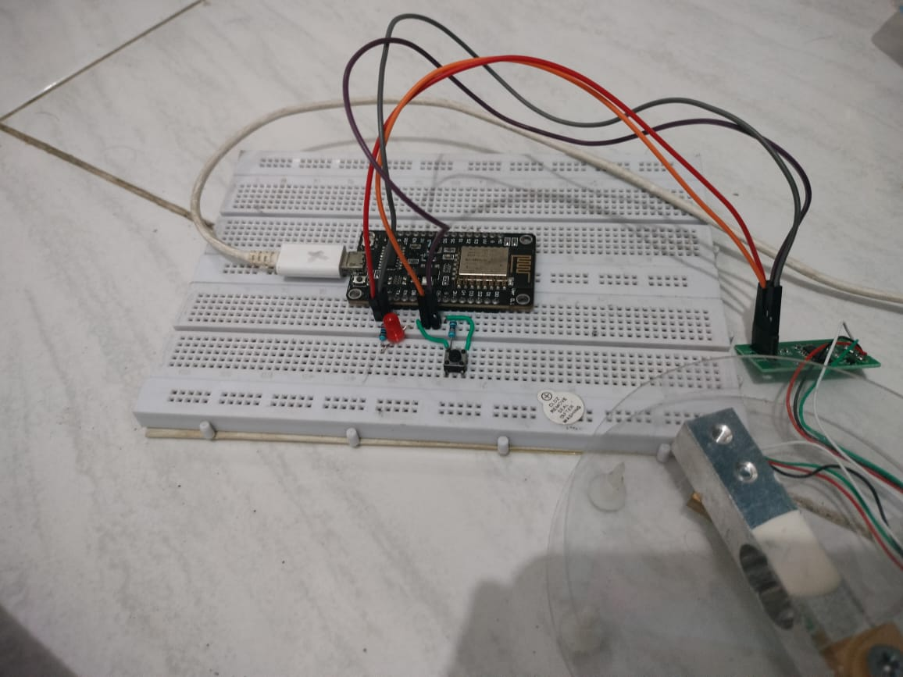
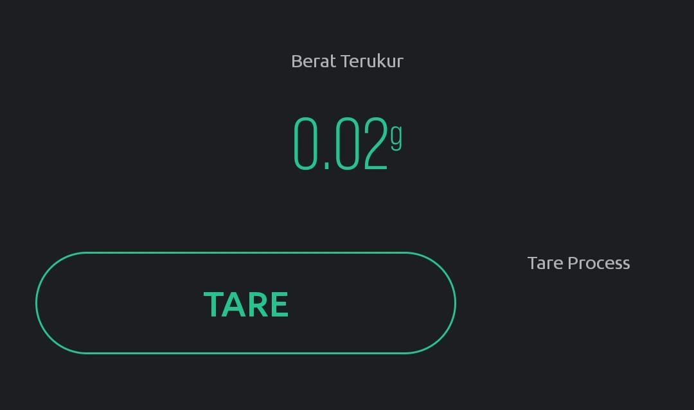

# Technical Details Project Elka

## Persiapan

1. Setup pemasangan library ESP8266 di Arduino IDE 
    
    [Installing ESP8266 in Arduino IDE (Windows, Mac OS X, Linux) | Random Nerd Tutorials](https://randomnerdtutorials.com/how-to-install-esp8266-board-arduino-ide/)
    
2. Alat dan Bahan
    1. **ESP8266** [NodeMCU 1.0 (ESP-12E Module)]
    2. **LED Merah**
    3. **Resistor 2 Biji** (220 Ohm dan 100K Ohm)
    4. **Push Button**
    5. **Kabel Micro-USB**
    6. ***Strain Gauge*** dan **HX711** (Modul ADC untuk konversi nilai resistansi *strain gauge* ke berat)
    7. **Project Board**
        
3. Siapkan hotspot seluler dengan mode 2.4Ghz (WiFi Kos Saya)
    - Username : **FALKO 1**
    - Password : **12345678**

## Penjelasan Alat dan Tampilan Blynk




TARE di sini adalah tombol untuk melakukan **zero set.**
Tare Process adalah indikator di mana proses zero set sedang dilakukan (akan menyala merah di tampilan blynk).
Proses zero set juga bisa dilakukan melalui tombol fisik yang ada pada project board. Jangan lupa sambungan ESP8266 dilakukan menggunakan **kabel microUSB.**

### Pin ESP8266

| PIN | Fungsi |
| --- | --- |
| D8 | LED |
| D7 | Input Push Button |
| D5 | DT HX711 (Strain Gauge) |
| D6 | SCK HX711 (Strain Gauge) |

## Penjelasan Bagian-Bagian Code

1. Deklarasi Library yang digunakan
    
    ```arduino
    #include <Arduino.h>
    #include <ESP8266WiFi.h>
    #include <BlynkSimpleEsp8266.h>
    #include "HX711.h"
    ```
    
    Library `<Arduino.h>`, `<ESP8266WiFi.h>` dan `<BlynkSimpleEsp8266.h>` sudah diinstall pada tahap persiapan di atas.
    
    Pastikan saat menginstall library `"HX711.h"`, pembuat/author nya adalah **Bodgan Necula**
    
2. Definisikan pin untuk memasang modul HX711
    
    ```arduino
    #define LOADCELL_DOUT_PIN D5
    #define LOADCELL_SCK_PIN D6
    
    HX711 scale;
    ```
    
3. Definisikan token dari Blynk dan Wifi yang akan disambungkan
    
    ```arduino
    #define BLYNK_TEMPLATE_ID "TMPL6IIFp_OfH"
    #define BLYNK_TEMPLATE_NAME "KECEWA BERAT"
    #define BLYNK_AUTH_TOKEN "B_ThmeYbdUXVkTf-2bMsE4ebasGSSpDl"
    #define BLYNK_PRINT Serial
    
    char auth[] = BLYNK_AUTH_TOKEN;
    
    // Wifi yang akan disambungkan
    char ssid[] = "FALKO 1";
    char pass[] = "12345678";
    
    BlynkTimer timer;
    ```
    
4. Fungsi yang membaca data dari sensor dan mengirim data tersebut ke Blynk
    
    ```arduino
    void myTimerEvent()
    {
        Blynk.virtualWrite(V0, scale.get_units(10));
        digitalWrite(D8, HIGH);
        delay(200);
        digitalWrite(D8, LOW);
        Serial.println("SENDING DATA...");
    }
    ```
    
5. Fungsi yang menghandle ketika dilakukan proses zero set dari Blynk
    
    ```arduino
    BLYNK_WRITE(V1)
    {
        int virtual_pin_value = param.asInt();
        if (virtual_pin_value == 1)
        {
            Serial.println("Weight measurement tared");
            scale.tare();
        }
    }
    ```
    
6. Fungsi yang menghandle proses zero set dari push button sekaligus menyalakan LED ketika push button dipencet.
    
    ```arduino
    void button()
    {
        bool state = !digitalRead(D7);
        if (state)
        {
            Serial.println("Weight measurement tared");
            digitalWrite(D8, HIGH);
            delay(200);
            digitalWrite(D8, LOW);
            scale.tare();
        }
    }
    ```
    
7. Void Setup
    
    ```arduino
    void setup()
    {
        Serial.begin(9600);
        Blynk.begin(auth, ssid, pass, "blynk.cloud", 80);
    
        Serial.println("Initializing the scale");
        scale.begin(LOADCELL_DOUT_PIN, LOADCELL_SCK_PIN);
        scale.set_scale(2280.f);
        scale.tare();
    
        pinMode(D8, OUTPUT);
        pinMode(D7, INPUT);
    
        timer.setInterval(3000L, myTimerEvent);
        timer.setInterval(100L, button);
    }
    ```
    
    Banyak yang dilakukan di sini, aku jelasin yang penting aja
    
    1. Penyambungan ke Wifi dan ke server Blynk, `"blynk.cloud"`
    2. Melakukan Zero Set awal pada strain gauge, `scale.tare();`
    3. Menjalankan fungsi `myTimerEvent` dalam interval 3 detik (3000 milidetik)
    4. Menjalankan fungsi `button` dalam interval 100 milidetik
8. Void Loop
    
    ```arduino
    void loop()
    {
        Blynk.run();
        timer.run(); // Initiates BlynkTimer
    }
    ```
    
    Berguna untuk memastikan ESP8266 tetap tersambung ke blynk dan fungsi-fungsi di atas tetap berjalan sebagaimana mestinya.
    

## Proses Kalibrasi

1. Panggil fungsi `set_scale()` tanpa parameter.
2. Panggil fungsi `tare()` tanpa parameter.
3. Tempatkan beban yang telah diketahui beratnya pada timbangan dan panggil `get_units(10)`.
4. Bagi hasil pada langkah 3 dengan beban yang diketahui. Anda seharusnya mendapatkan sekitar parameter yang perlu Anda lewati ke `set_scale()`.
5. Sesuaikan parameter pada langkah 4 sampai Anda mendapatkan bacaan yang akurat.